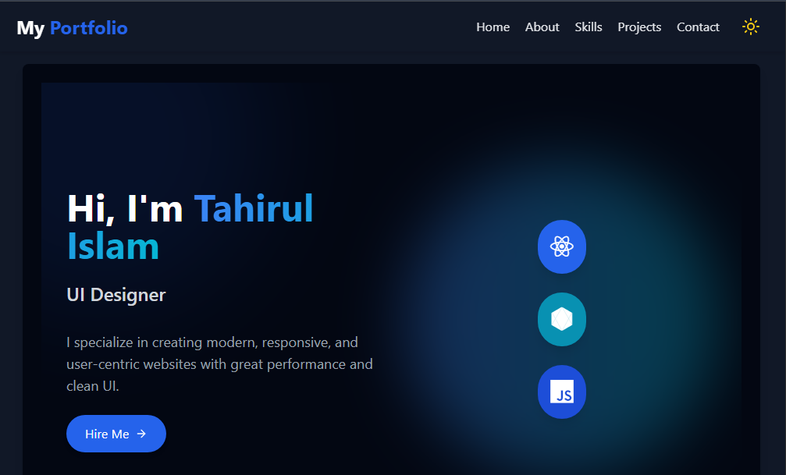

# 🚀 React + Vite Project

This is a minimal setup for a React project using Vite, with support for HMR (Hot Module Replacement) and ESLint rules for better development practices.

## My Portfolio Website

## 📌 Project Description

This is a fully responsive **personal portfolio website** built using **React** and **Vite**. The website showcases my work, skills, and projects in a modern and elegant design. It features smooth animations, a clean user interface, and fast loading performance, thanks to Vite's lightning-fast bundler.

Key highlights include:

- 🧑‍💻 About Me section with skill highlights  
- 📂 Dynamic project showcase with live links  
- 📞 Contact form with email integration  
- 🌙 Dark/light theme toggle 
- 📱 Fully responsive design for all screen sizes  

This portfolio serves as my digital resume and professional presence on the web.

## 🔗 Live Demo

👉 [Click here to view the project](https://tahir1605.github.io/My-Portfolio/)

---

## 🔧 ESLint Configuration Notes

Currently, two official plugins are available:

- [@vitejs/plugin-react](https://github.com/vitejs/vite-plugin-react/blob/main/packages/plugin-react) uses [Babel](https://babeljs.io/) for Fast Refresh
- [@vitejs/plugin-react-swc](https://github.com/vitejs/vite-plugin-react/blob/main/packages/plugin-react-swc) uses [SWC](https://swc.rs/) for Fast Refresh

### Expanding the ESLint configuration

If you are developing a production application, we recommend using TypeScript with type-aware lint rules enabled. Check out the [TS template](https://github.com/vitejs/vite/tree/main/packages/create-vite/template-react-ts) for more information on how to integrate TypeScript and [`typescript-eslint`](https://typescript-eslint.io) in your project.
